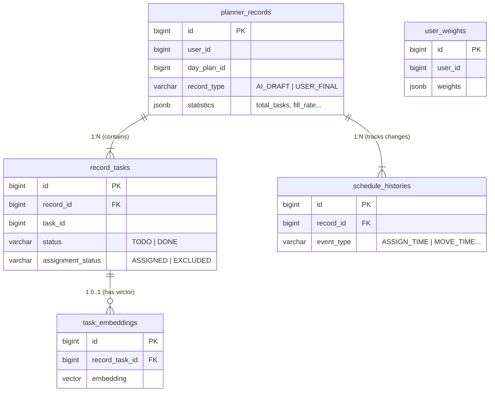

# AI 플래너 & 개인화 데이터베이스 스키마 및 API 연동 문서

> **작성일:** 2026-01-27
> **목적:** AI 서비스의 데이터베이스(Supabase) 전체 스키마 정의 및 `POST /ai/v1/personalizations/ingest` API 상세 연동 가이드
> **참고:** 기존 `planner_records` 스키마에 개인화 학습을 위한 필드(`age`, `gender`, `status`) 및 이력 테이블(`schedule_histories`)이 추가되었습니다.

---

## 1. 데이터베이스 스키마 (SQL)

### 1-1. 데이터베이스 관계도 (ERD)



### 1-2. DDL 스크립트 (SQL)


이 SQL 스크립트는 기존 테이블을 모두 삭제하고 새로 생성합니다. **데이터 유실에 주의하세요.**

```sql
-- pgvector 확장 기능 활성화 (임베딩 검색용)
CREATE EXTENSION IF NOT EXISTS vector;

-- ============================================
-- 0) RPC Functions: 임베딩 검색 (MCP Tool 연동)
-- ============================================
-- 용도: 챗봇 MCP에서 의미적 유사도(Semantic Search) 기반 과거 태스크 검색을 위한 DB 내장 함수
CREATE OR REPLACE FUNCTION match_record_tasks (
  p_user_id bigint,
  query_embedding vector(768),
  match_count int
)
RETURNS TABLE (
  id bigint,
  record_id bigint,
  title varchar,
  status varchar,
  focus_level int,
  is_urgent boolean,
  category varchar,
  start_at varchar,
  end_at varchar,
  plan_date date,
  focus_time_zone varchar,
  similarity float
)
LANGUAGE plpgsql
AS $$
BEGIN
  RETURN QUERY
  SELECT
    rt.id,
    rt.record_id,
    rt.title,
    rt.status,
    rt.focus_level,
    rt.is_urgent,
    rt.category,
    rt.start_at,
    rt.end_at,
    pr.plan_date,
    pr.focus_time_zone,
    1 - (rt.combined_embedding_text::vector <=> query_embedding) AS similarity
  FROM record_tasks rt
  JOIN planner_records pr ON pr.id = rt.record_id
  WHERE pr.user_id = p_user_id
    AND pr.record_type = 'USER_FINAL'
    AND rt.assignment_status = 'ASSIGNED'
    AND rt.combined_embedding_text IS NOT NULL
  ORDER BY rt.combined_embedding_text::vector <=> query_embedding
  LIMIT match_count;
END;
$$;

-- ============================================
-- 1) user_weights: 개인화 가중치
-- ============================================
-- 용도: 사용자별 WeightParams 저장, 주간 학습으로 업데이트
CREATE TABLE user_weights (
    id BIGSERIAL PRIMARY KEY,
    user_id BIGINT NOT NULL UNIQUE,

    -- WeightParams 전체를 JSONB로 저장 (기본값 설정)
    weights JSONB NOT NULL DEFAULT '{
        "w_focus": 1.0,
        "w_urgent": 5.0,
        "w_category": {},
        "w_carry_task": 2.0,
        "w_carry_group": 1.0,
        "w_reject_penalty": 2.0,
        "alpha_duration": 0.05,
        "beta_load": 1.0,
        "w_included": 1.0,
        "w_excluded": 1.2,
        "w_overflow": 2.0,
        "w_focus_align": 0.8,
        "w_switch": 0.2,
        "w_fatigue_risk": 0.5,
        "w_instruction": 0.3,
        "instruction_cap": 0.4,
        "clip_min": 0.1,
        "clip_max": 5.0,
        "ema_decay": 0.7
    }'::jsonb,

    version INT DEFAULT 1,
    created_at TIMESTAMPTZ DEFAULT NOW(),
    updated_at TIMESTAMPTZ DEFAULT NOW()
);

CREATE INDEX idx_user_weights_user_id ON user_weights(user_id);

-- ============================================
-- 2) planner_records: 플래너 실행 메타데이터
-- ============================================
-- 용도: AI 초안(AI_DRAFT) vs 사용자 최종(USER_FINAL) 비교로 개인화 학습
CREATE TABLE planner_records (
    id BIGSERIAL PRIMARY KEY,
    user_id BIGINT NOT NULL,
    day_plan_id BIGINT NOT NULL,

    -- 레코드 타입
    record_type VARCHAR(20) NOT NULL,    -- 'AI_DRAFT' | 'USER_FINAL'

    -- 실행 메타데이터
    start_arrange VARCHAR(5) NOT NULL,   -- 배치 시작 시각 "HH:MM"
    day_end_time VARCHAR(5) NOT NULL,    -- 하루 종료 시각 "HH:MM"
    focus_time_zone VARCHAR(10) NOT NULL, -- MORNING|AFTERNOON|EVENING|NIGHT

    -- [NEW] 사용자 인구통계 정보 (개인화 Ingest 시 저장)
    user_age INT,                        -- 나이
    user_gender VARCHAR(10),             -- 성별 ('MALE', 'FEMALE', 'OTHER')

    -- 결과 요약
    total_tasks INT NOT NULL,            -- 전체 FLEX 작업 수
    assigned_count INT NOT NULL,         -- 배치된 작업 수
    excluded_count INT NOT NULL,         -- 제외된 작업 수
    fill_rate DECIMAL(5,4),              -- 가동률 (0.0000 ~ 1.0000)

    -- 실행 정보 (AI_DRAFT 전용, USER_FINAL은 null)
    weights_version INT,                 -- 사용된 가중치 버전

    created_at TIMESTAMPTZ DEFAULT NOW()
);

CREATE INDEX idx_records_user_day ON planner_records(user_id, day_plan_id);
CREATE INDEX idx_records_type ON planner_records(record_type);
CREATE INDEX idx_records_created ON planner_records(created_at);

-- ============================================
-- 3) record_tasks: 개별 작업 상세
-- ============================================
-- 용도: 작업별 분석 결과 + 배치 결과 저장
CREATE TABLE record_tasks (
    id BIGSERIAL PRIMARY KEY,
    record_id BIGINT NOT NULL REFERENCES planner_records(id) ON DELETE CASCADE,

    -- 기본 식별 정보
    task_id BIGINT NOT NULL,
    day_plan_id BIGINT NOT NULL,
    title VARCHAR(60) NOT NULL,

    -- [NEW] 작업 상태 (개인화 Ingest 시 저장)
    status VARCHAR(10),                  -- 'TODO' | 'DONE'

    -- 원본 입력 정보 (Request에서)
    task_type VARCHAR(10) NOT NULL,      -- 'FIXED' | 'FLEX'
    parent_schedule_id BIGINT,           -- 상위 작업 ID
    estimated_time_range VARCHAR(20),    -- MINUTE_UNDER_30 등
    focus_level INT,                     -- 1-10
    is_urgent BOOLEAN,

    -- Node1 결과: Structure Analysis (AI_DRAFT만 해당)
    category VARCHAR(30),                -- 학업, 업무, 운동 등
    cognitive_load VARCHAR(10),          -- LOW | MED | HIGH
    group_id VARCHAR(50),                -- 그룹 식별자
    group_label VARCHAR(60),             -- 그룹 라벨
    order_in_group INT,                  -- 그룹 내 순서

    -- Node2 결과: Importance (AI_DRAFT만 해당)
    importance_score DECIMAL(10,4),      -- 중요도 점수
    fatigue_cost DECIMAL(10,4),          -- 피로도 비용
    duration_avg_min INT,                -- 평가용 시간 (분)
    duration_plan_min INT,               -- 배치용 시간 (분)
    duration_min_chunk INT,              -- 최소 분할 단위
    duration_max_chunk INT,              -- 최대 분할 단위

    -- 배치 결과: Assignment
    assignment_status VARCHAR(20) NOT NULL,  -- 'ASSIGNED' | 'EXCLUDED' | 'NOT_ASSIGNED'
    assigned_by VARCHAR(10) NOT NULL,        -- 'AI' | 'USER'
    start_at VARCHAR(5),                     -- 배치된 시작 시간 "HH:MM"
    end_at VARCHAR(5),                       -- 배치된 종료 시간 "HH:MM"

    -- 분할 정보 (children)
    is_split BOOLEAN DEFAULT FALSE,          -- 분할 여부
    children JSONB,                          -- 분할된 경우 SubTaskResult[] JSON

    -- 임베딩용 텍스트 (추후 임베딩 생성에 사용)
    combined_embedding_text TEXT,            -- "카테고리: {CAT} | 작업: {Group} - {Title}"

    created_at TIMESTAMPTZ DEFAULT NOW()
);

CREATE INDEX idx_record_tasks_record ON record_tasks(record_id);
CREATE INDEX idx_record_tasks_task ON record_tasks(task_id);
CREATE INDEX idx_record_tasks_category ON record_tasks(category);
CREATE INDEX idx_record_tasks_status ON record_tasks(assignment_status);

-- ============================================
-- 4) schedule_histories: 일정 변경 이력 (NEW)
-- ============================================
-- 용도: 사용자가 AI 제안을 어떻게 수정했는지 기록 (개인화 학습용)
CREATE TABLE schedule_histories (
    id BIGSERIAL PRIMARY KEY,
    record_id BIGINT NOT NULL REFERENCES planner_records(id) ON DELETE CASCADE,
    
    schedule_id BIGINT NOT NULL,       -- 원본 Schedule ID (= task_id)
    event_type VARCHAR(20) NOT NULL,   -- 'ASSIGN_TIME', 'MOVE_TIME', 'CHANGE_DURATION'
    
    prev_start_at VARCHAR(5),          -- 변경 전 시작 "HH:MM"
    prev_end_at VARCHAR(5),            -- 변경 전 종료 "HH:MM"
    
    new_start_at VARCHAR(5) NOT NULL,  -- 변경 후 시작 "HH:MM"
    new_end_at VARCHAR(5) NOT NULL,    -- 변경 후 종료 "HH:MM"
    
    created_at_client TIMESTAMPTZ NOT NULL, -- 클라이언트 발생 시각 (정렬 기준)
    created_at_server TIMESTAMPTZ DEFAULT NOW()
);

CREATE INDEX idx_histories_record ON schedule_histories(record_id);
CREATE INDEX idx_histories_created_client ON schedule_histories(created_at_client);

-- ============================================
-- 5) task_embeddings: 임베딩 저장
-- ============================================
-- 용도: 챗봇 MCP 자연어 검색 (Gemini 768차원 기준)
CREATE TABLE task_embeddings (
    id BIGSERIAL PRIMARY KEY,
    user_id BIGINT NOT NULL,
    
    -- 원본 데이터 참조
    task_id BIGINT,                            -- 원본 Task ID
    record_task_id BIGINT REFERENCES record_tasks(id) ON DELETE SET NULL,

    -- 임베딩 대상 텍스트
    content TEXT NOT NULL,                     -- 예: "카테고리: 운동 | 작업: 헬스장 가기 - 하체 운동"
    
    -- 벡터 데이터 (Gemini text-embedding-004 기준 768차원)
    embedding VECTOR(768), 
    
    -- 메타데이터
    category VARCHAR(50),
    created_at TIMESTAMPTZ DEFAULT NOW()
);

-- 검색 성능 향상을 위한 HNSW 인덱스
CREATE INDEX ON task_embeddings USING hnsw (embedding vector_cosine_ops);
CREATE INDEX idx_task_embeddings_user_id ON task_embeddings(user_id);

-- ============================================
-- 6) weekly_reports: 주간 레포트
-- ============================================
-- 용도: AI가 생성한 주간 레포트 저장 및 챗봇 컨텍스트용
CREATE TABLE weekly_reports (
    id BIGSERIAL PRIMARY KEY,
    
    -- Backend에서 발급받은 Report ID (식별자)
    report_id BIGINT NOT NULL UNIQUE,
    user_id BIGINT NOT NULL,

    -- 기준 날짜 (레포트 생성일인 월요일, ex: 2026-01-12라면 01.05~01.11 데이터 대상)
    base_date DATE NOT NULL,
    
    -- 레포트 본문 (Markdown 형식)
    content TEXT NOT NULL,

    created_at TIMESTAMPTZ DEFAULT NOW(),
    updated_at TIMESTAMPTZ DEFAULT NOW()
);

CREATE INDEX idx_weekly_reports_report_id ON weekly_reports(report_id);
CREATE INDEX idx_weekly_reports_user_base ON weekly_reports(user_id, base_date);
```

---

## 2. API 연동 가이드: 개인화 AI (Ingest)

**Endpoint:** `POST /ai/v1/personalizations/ingest`

이 API는 사용자의 최종 플래너 상태와 수정 이력을 받아 위 데이터베이스에 저장합니다.

### 2.1 저장 로직 (Backend → DB)

Backend에서 이 API를 호출하면, AI 서버는 다음 순서로 데이터를 저장해야 합니다.

1.  **Planner Record 생성 (`planner_records`)**
    *   `record_type` = `'USER_FINAL'` 고정
    *   `user_id`, `day_end_time`, `focus_time_zone` 매핑
    *   **[NEW]** `user_age`, `user_gender` 매핑
    *   `total_tasks` 등 통계값 계산하여 저장

2.  **Tasks 저장 (`record_tasks`)**
    *   Request의 `schedules[]` 배열을 순회하며 모두 INSERT
    *   `record_id`는 위 1번에서 생성한 ID 사용
    *   **[NEW]** `status` ('TODO'/'DONE') 매핑
    *   `assigned_by`, `assignment_status` 그대로 매핑

3.  **Histories 저장 (`schedule_histories`)**
    *   Request의 `scheduleHistories[]` 배열을 순회하며 모두 INSERT
    *   `record_id`는 위 1번에서 생성한 ID 사용
    *   `createdAt` → `created_at_client` 매핑 (ISO 8601 파싱 필요)

### 2.2 주의사항

*   **트랜잭션:** 레코드, 태스크, 이력 저장은 하나의 트랜잭션으로 묶여야 합니다. 중간에 실패하면 전체 롤백되어야 데이터 정합성이 유지됩니다.
*   **시간 포맷:** DB의 시간 컬럼(`start_arrange`, `start_at` 등)은 모두 `VARCHAR(5)` ("HH:MM") 형식입니다.
*   **날짜 포맷:** `created_at_client`는 `TIMESTAMPTZ`이므로 ISO 8601 문자열을 파싱해서 저장해야 합니다.

---

## 3. 환경 변수 설정 (Configuration)

이 API를 실행하기 위해서는 `.env` 파일에 다음 환경 변수들이 필수로 설정되어 있어야 합니다.

```bash
# Supabase Configuration
# - DB 접속 및 데이터 저장(Ingest)을 위해 필요합니다.
SUPABASE_URL=https://your-project.supabase.co
SUPABASE_KEY=your-service-role-key  # 또는 anon-key (권한 정책에 따라 다름)

# Google Gemini API Key
# - (현재 단계에서는 Ingest API에 직접 사용되지 않지만, 전체 서버 실행을 위해 필요)
GEMINI_API_KEY=your-gemini-api-key
```

> **참고**: 로컬 개발 시 `.env.example` 파일을 복사하여 `.env`를 생성하고 값을 채워주세요.


---

## 4. [긴급] 스키마 마이그레이션 (이미 테이블이 존재하는 경우)

만약 이미 테이블이 생성되어 있고 데이터가 존재한다면, 테이블을 삭제하지 말고 아래 SQL을 실행하여 컬럼을 추가하세요.

### 4-1. 모든 테이블에 날짜 컬럼 추가 (`created_date` / `plan_date`)

`created_at`이 생성될 때 자동으로 해당 날짜가 들어가도록 `DEFAULT`를 설정합니다.
기존 데이터는 `UPDATE` 문으로 채워줍니다.

```sql
-- 1) planner_records: 플래너 날짜
ALTER TABLE planner_records 
ADD COLUMN plan_date DATE NOT NULL DEFAULT CURRENT_DATE;

-- 기존 데이터 업데이트 (created_at 기준)
UPDATE planner_records SET plan_date = created_at::date;


-- 2) record_tasks: 작업 날짜
ALTER TABLE record_tasks 
ADD COLUMN created_date DATE NOT NULL DEFAULT CURRENT_DATE;

UPDATE record_tasks SET created_date = created_at::date;


-- 3) schedule_histories: 이력 날짜
ALTER TABLE schedule_histories 
ADD COLUMN created_date DATE NOT NULL DEFAULT CURRENT_DATE;

UPDATE schedule_histories SET created_date = created_at_server::date;


-- 4) user_weights: 가중치 날짜
ALTER TABLE user_weights 
ADD COLUMN created_date DATE NOT NULL DEFAULT CURRENT_DATE;

UPDATE user_weights SET created_date = created_at::date;


-- 5) task_embeddings: 임베딩 날짜
ALTER TABLE task_embeddings 
ADD COLUMN created_date DATE NOT NULL DEFAULT CURRENT_DATE;

UPDATE task_embeddings SET created_date = created_at::date;
```

> **참고:** Supabase(PostgreSQL)에서는 `DEFAULT CURRENT_DATE`를 설정하면, 데이터 INSERT 시 별도로 값을 넣지 않아도 **자동으로 DB 서버 시간 기준(한국 서버로 지정했음) 오늘 날짜**가 들어갑니다. 백엔드 코드를 수정할 필요가 없습니다.

### 4-2. 신규 테이블 추가 (weekly_reports)

> **주의:** 이 섹션은 이미 운영 중인 DB에 추가할 때만 사용하세요. (Section 1에서 전체 생성 시에는 불필요)

```sql
CREATE TABLE IF NOT EXISTS weekly_reports (
    id BIGSERIAL PRIMARY KEY,
    
    -- Backend에서 발급받은 Report ID (식별자)
    report_id BIGINT NOT NULL UNIQUE,
    user_id BIGINT NOT NULL,

    -- 기준 날짜 (레포트 생성일인 월요일, ex: 2026-01-12라면 01.05~01.11 데이터 대상)
    base_date DATE NOT NULL,
    
    -- 레포트 본문 (Markdown 형식)
    content TEXT NOT NULL,

    created_at TIMESTAMPTZ DEFAULT NOW(),
    updated_at TIMESTAMPTZ DEFAULT NOW()
);

CREATE INDEX IF NOT EXISTS idx_weekly_reports_report_id ON weekly_reports(report_id);
CREATE INDEX IF NOT EXISTS idx_weekly_reports_user_base ON weekly_reports(user_id, base_date);
```
